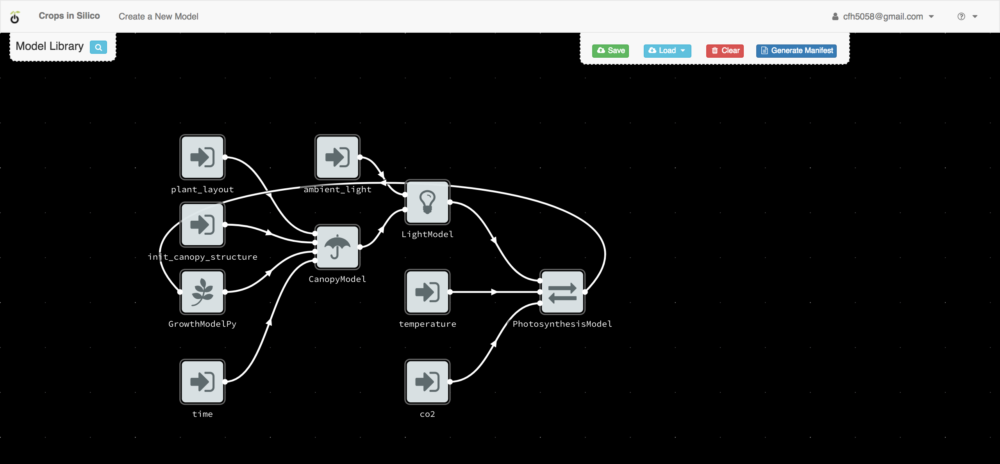
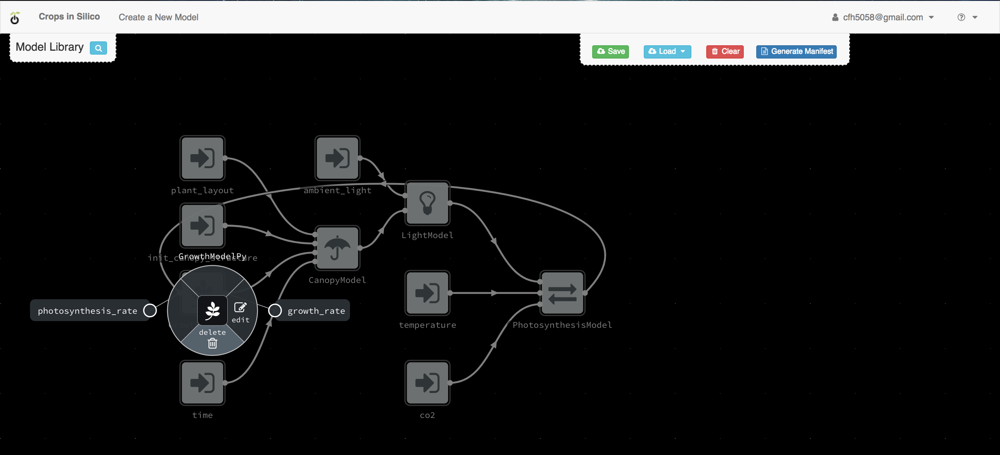
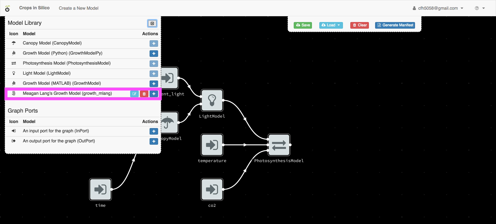
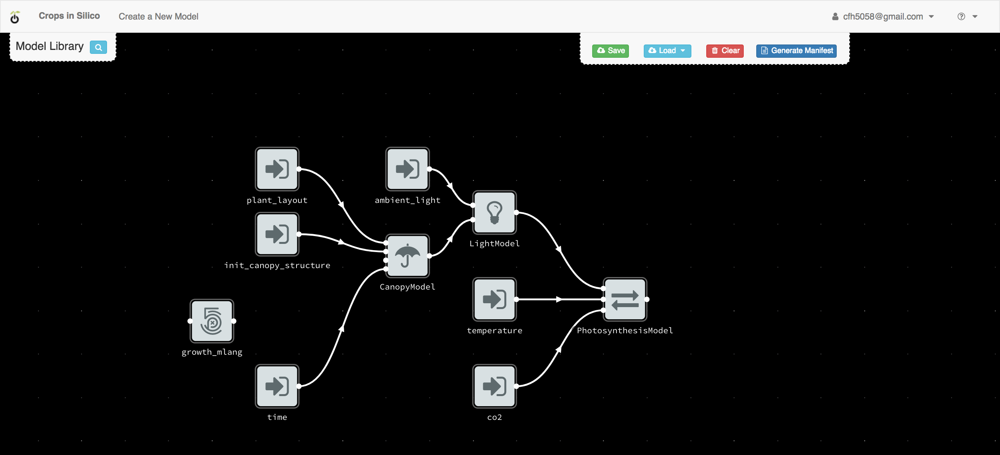
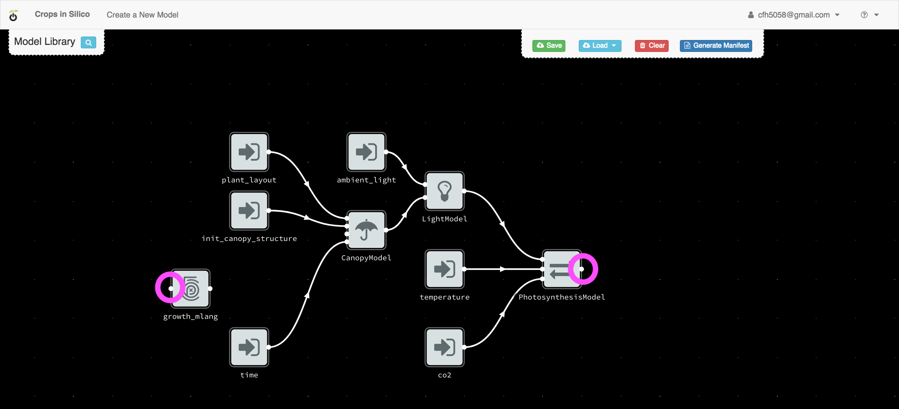
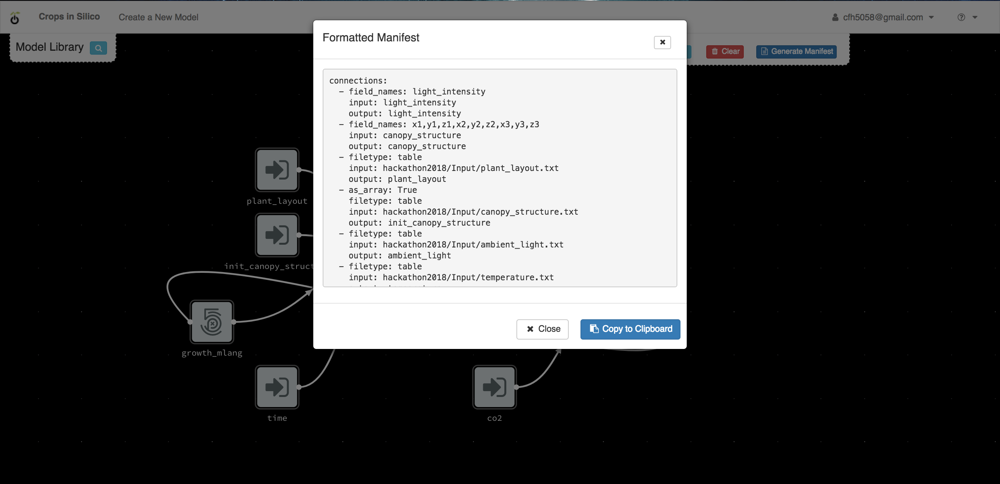

Connecting Models to Models
###########################

Next we will connect your growth model to an existing network of models. From 
the user interface, load the ``hackathon2018`` integration network. 

.. image:: interface_images/interface_load.png

You will see a network of 4 models connected to 6 input files.

By right clicking on each model, you can get information about the model's 
inputs and outputs.

Model Overview
==============

The canopy model takes as input an initial canopy structure, a growth rate, 
a plant layout describing how the plant grows in x, y, and z, and a time step. 
From this information it grows the canopy structure and outputs the updated 
structure. The canopy model is written in C++.

.. image:: interface_images/network_canopy.png

The light model takes as input an ambient light level and the 3D structure of 
the canopy. It then calculates the light incident on each facet of the canopy 
structure which it outputs.

.. image:: interface_images/network_light.png

The photosynthesis model takes as input a light intensity, temperature, and 
CO2. From this information, it calculates and output the photosynthesis rate. 

.. image:: interface_images/network_photosynthesis.png

The growth model in this network is an alternative to the growth model we 
were working with in the previous section. It takes photosynthesis rate as 
an input and outputs the growth rate. We will be replacing this growth model 
with the one you created.

.. image:: interface_images/network_growth.png

You can trace the data as it flows from files and from one model to the next.

Replacing the Growth Model
==========================

For the next exercise, we will replace the existing growth model, with the 
one you just created.

Deleting the Old Model
----------------------

By right-clicking on the existing growth model, you can delete the existing 
model from the canvas.

Adding Your Model
-----------------

You can then add your model by clicking the blue ``+`` button next to your 
model in the model palette.

Once the model is added to the canvas, move it to the left of the canvas.

Making Connections
------------------

Now we want to connect our growth model to the other models in the network. 
First we connect the input dot (on the left side) for our growth model to 
the output from the photosynthesis model.

To make the connection, click on one dot and then the other.

.. image:: interface_images/network_input.png

Next we connect the output from our growth model to the growth rate input 
channel of the canopy model, by again clicking on one dot and then the other.

.. image:: interface_images/network_output_dots.png

.. image:: interface_images/network_output.png

Creating the YAML
=================

Once you have finalized your model connections, you can use the interface to 
create your YAML file by clicking the ``Generate Manifest`` button,

Copy this information to you clipboard and past it into a new file 
called ``growth_network.yml`` in the ``ygg_home`` directory.

Running the Model-to-Model Integration
======================================

You can run the integration you just created by executing::

  $ yggrun growth_network.yml

from the ``ygg_home`` directory. This will output information on the 
screen from all of the models being run.
