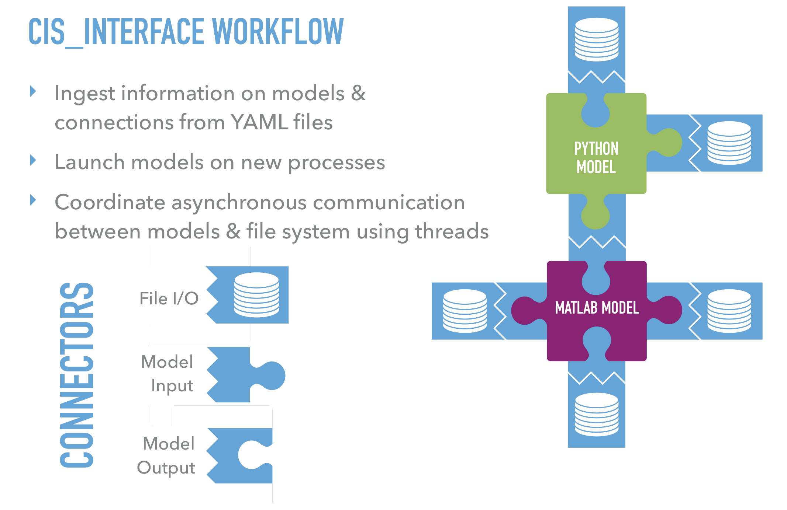

Introduction
############

Parallel Processing
===================

.. image:: interface_images/intro_parallel.png

Communication
=============

Model API
=========

The API classes/functions in each language provide the models 
with methods of sending and receiving messages to and from files and other 
models.

Python API
----------

::

  from cis_interface.interface.CisInterface import CisInput, CisOutput

  input = CisInput('input_name')
  output = CisOutput('output_name', '%f\t%f\n')

  flag, data = input.recv()
  flag = output.send(1.0, 2.0)

Matlab API
----------

::

  input = CisInterface('CisInput', 'input_name');
  output = CisInterface('CisOutput', 'output_name', '%f\t%f\n');

  [flag, data] = input.recv();
  flag = output.send(1.0, 2.0);

C API
-----

::

  #include "CisInterface.h"

  cisInput_t input = cisInput("input_name");
  cisOutput_t output = cisOutput("output_name", "%f\t%f\n");

  float a;
  float b = 1;
  float c = 2;
  int flag = cisRecv(input, &a);
  flag = cisSend(output, b, c);

C++ API
-------

::

  #include "CisInterface.hpp"

  CisInput input("input_name");
  CisOutput output("output_name", "%f\t%f\n");

  float a;
  float b = 1;
  float c = 2;
  int flag = input.recv(&a);
  flag = output.send(b, c);