Model Transformation
####################

For the first part of this example we will be transforming a 
toy growth model written in Python. Within the ``hackathon2018`` 
repository directory this model is ``growth.py``. The model takes 
command line arguments defining the path to an input file and 
an output file. The model then reads photosynthesis rates from 
the input file, calculates the growth rate (incorrectly) and 
then outputs the growth rate to the output file. You can run this 
model from the command line using the following command::

  $ python growth.py Input/photosynthesis_rate.txt Output/growth_rate.txt

Then you can take a look at the output produced by the model. We will 
be transforming this model so make a copy, adding your name to the end of 
the file.::

  $ cp growth.py growth_mlang.py

Then move back up into the ``ygg_home`` direcotry.

  $ cd ../

Adding API Calls
================

The first step in transforming this model is to replace the calls 
reading/writing input/output from/to files with API calls that will 
instead receive/send input/output from/to the |yggdrasil| framework. 
There is a |yggdrasil| API in C, C++, Python and Matlab. 

Importing the API
-----------------

Since the test 
model is in Python, we first need to import the necessary classes, this can be 
accomplished with the line::

  from yggdrasil.interface import YggInput, YggOutput

This imports the Python API classes for connecting to input and output channels. 

Connecting to Channels
----------------------

Next we need to tell the model to connect to input/output channels. This can 
be done by replacing the lines::

  filename_input = sys.argv[1]
  filename_output = sys.argv[2]

with::

  input = YggInput('photosynthesis_rate')
  output = YggOutput('growth_rate', '%f\n')

The first call creates the ``input`` object that connects to a channel named 
``photosynthesis_rate``. The second creates an ``output`` object that connects 
to a channel called ``growth_rate`` that takes the form of a float followed by 
a newline character.

Loop over input, run calculation, & send to output
--------------------------------------------------

The next step in our model loops over the input photosynthesis rates, 
calculating the growth rate. When we are using input from |yggdrasil|, 
we will want to continue looping over input until the channel is closed. To 
do so we can use a while loop that only breaks when receivinga message from 
the interface fails. In addition, we will want to send each calculated 
growth rate to the output. This is accomplished by replacing the following lines::

  # Load arrays from files                                                                                                                                                             
  data_input = np.loadtxt(filename_input)

  # Loop over photosynthetic rates, calculating growth                                                                                                                                 
  data_output = []
  for prate in data_input:
      grate = 0.5 * prate
      print('growth: photosynthesis rate = %f ---> growth rate = %f' % (
          prate, grate))
      data_output.append(grate)

  # Save data to output file                                                                                                                                                           
  np.savetxt(filename_output, data_output)

with::

  # Loop over photosynthetic rates, calculating growth                                                                                                                                 
  while True:
      # Receive photosynthetic rate                                                                                                                                                    
      flag, data_input = input.recv()
      if not flag:
          print('growth: No more input.')
          break
      prate = data_input[0]
      # Calculate growth                                                                                                                                                               
      grate = 0.5 * prate
      print('growth: photosynthesis rate = %f ---> growth rate = %f' % (
          prate, grate))
      # Send growth to output                                                                                                                                                          
      flag = output.send(grate)
      if not flag:
          raise Exception('growth: Error sending growth rate.')

Lets break this down into the important lines. The line::

  flag, data_input = input.recv()

Is where the model is receiving data from the input channel. It returns a 
flag indicating whether or not the receive was successful and a tuple 
containing all of the received variables (in this case a single float). 
The flag will return False if the channel has been closed (usually if there 
is not any more input) or if there is an error. It can be used to break out 
of a loop over input. The calculation step, namely the line::

  grate = 0.5 * prate

remained unchanged in the transformed code, illustrating that you can reuse the
same code form the original model. For this example the calculation was very 
simple and could just be copied manually, but for more complex calculations as 
you would encounter with real models, you can import the existing code so it 
does not need to be replicated. Finally, the line::

  flag = output.send(grate)

sends the calculated growth rate to the output channel and returns a flag that 
indicates if the send was successful or not. This flag should be checked to 
ensure that you do not continue looping in the event that the output channel 
was closed due to an error.

Registering Model
=================

Next we will use the user-interface to register the model and connect it to 
some files to replicate the original behavior of the model. First, go to 
the user interface located `here <https://hackathon.cis.ndslabs.org/>`_. 

.. image:: interface_images/interface_empty.png

To register a new model, you will need to log in using your GitHub credentials 
in the upper left hand corner.

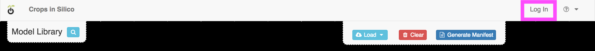

Once you are logged in, a new menu item will appear for adding a new model.

.. image:: interface_images/interface_create_model.png

Clicking that menu option will pull up a form where you can enter information about 
your model.

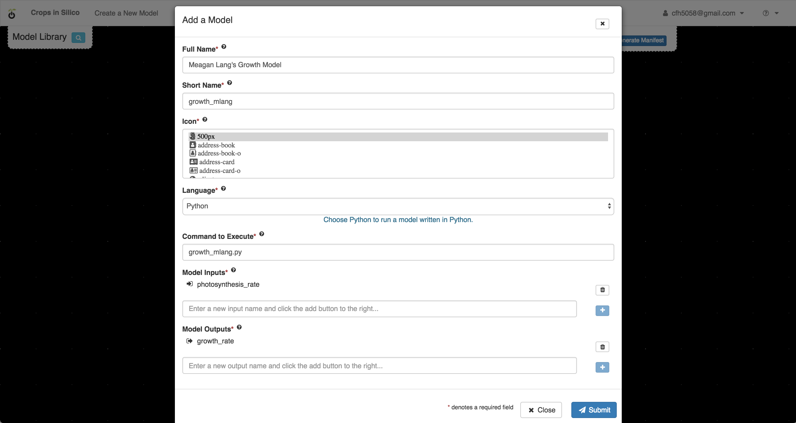

You can give your model any name, but make sure that you select ``Python`` as 
the model language, use the name of your transformed model with the ``hackathon2018``
directory included (e.g. ``hackathon2018/growth_mlang.py``), 
and the correct names of your input and output channels. For the example we have an 
input channel called ``photosynthesis_rate`` and an output channel called ``growth_rate``. 
For the input and output channels to be added, you will need to click on the blue ``+`` 
buttons after filling in the name. You can enter as many channels as your model requires, 
but for now our model only requires one of each.

Once you have finished entering information for your model, you can save your model by 
clicking submit. Now, if you click on the magnifying glass, 

.. image:: interface_images/interface_show_models.png

you will see your model among those listed.

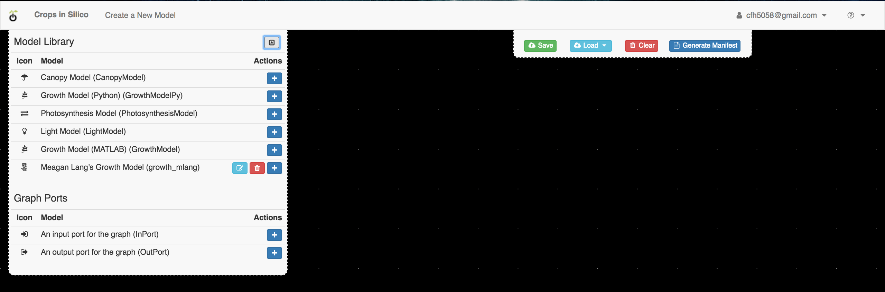

Connecting Models to Files
==========================

Now that we have added your model, we can create a network that connects your 
model's input/output channels to files, essentially performing the same function 
as the original model. 

Adding Your Model
-----------------

To add your model to the canvas, click the blue ``+`` button 
next to your model in the model palatte.

.. image:: interface_images/interface_your_model.png

Your model will then appear on the canvas. 

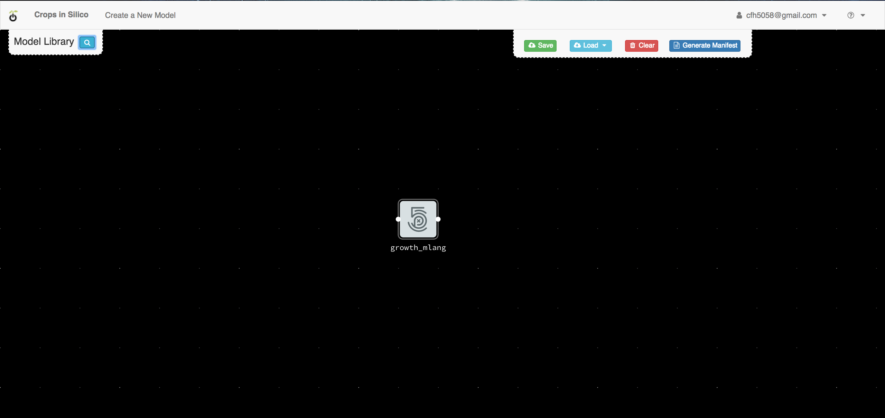

Your model input and output channels are represented by white dots. Inputs are on 
the left and outputs are on the right. But we need something to connect them to. 

Input File
----------

First we will add an input file. From the model palette, select an input port.

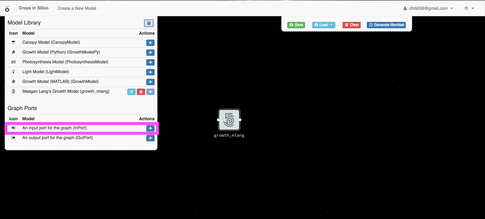

When you click the blue ``+`` button, an input port will be added to the canvas 
and a form will pop up asking for information about the input port. 

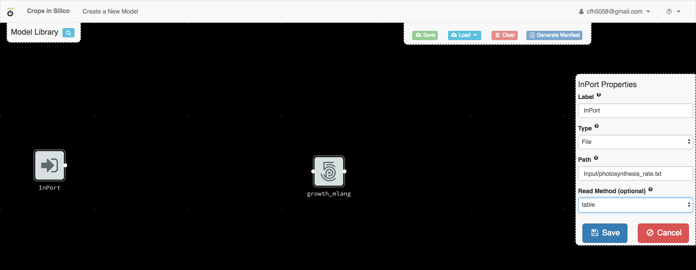

For this example 
you should select the ``file`` type, a file name of 
``hackathon2018/Input/photosynthesis_rate.txt`` 
and a read method of ``table``. This tells the input port that it should read values 
from a tab-delimited table line-by-line from the indicated file.

Output File
-----------

Next we will add an output file. From th emodel palette, select an output port.

.. image:: interface_images/interface_select_output.png

When you click the blue ``+`` button, an output port will be added to the canvas 
and a form will pop up asking for information about the output port. 

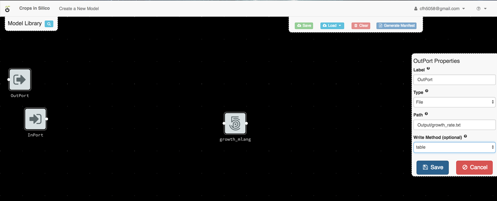

For this example 
you should select the ``file`` type, a file name of 
``hackathon2018/Output/growth_rate.txt``, 
and a write method of ``table``. This tells the output port that it should write values 
to a tab-delimited table line-by-line in the indicated file.

Making Connections
------------------

Now that we have added all of the necessary pieces, we need to connect them. You 
can rearange the different components on the canvas by dragging and dropping them. The 
following layout will make the connections easier to understand.

.. image:: interface_images/interface_no_connections.png

To make the input connection, click on the input port's white dot 

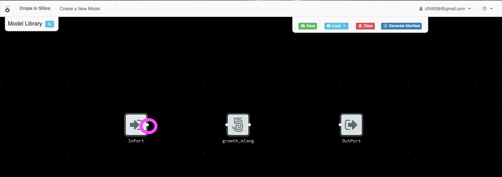

and then click on the input dot (on the left side) on your model.

.. image:: interface_images/interface_input_connection.png

To make the output connection, click on the output dot (on the right side) of 
your model

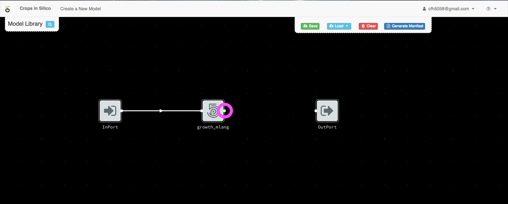

and then click on the input port's dot.

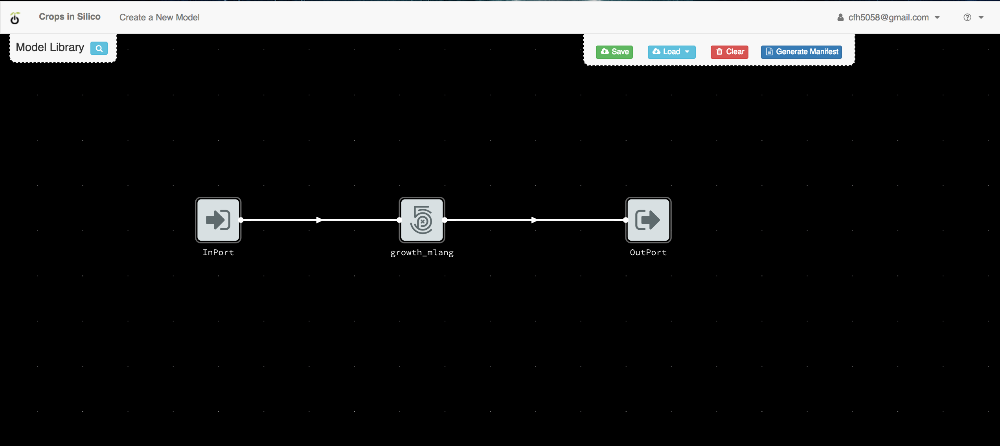

Creating the YAML
-----------------

Once you are finished creating your input and output connections, you can 
use the interface to create your YAML file. If you click the ``Generate Manifest`` 
button, 

.. image:: interface_images/interface_generate.png

the interface will compile the necessary contents of the YAML file for 
running your model with connections to the file.

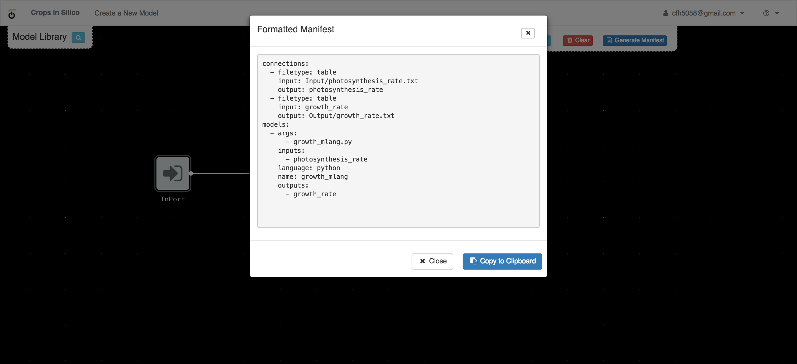

You can then copy that information to your clipboard and past it into a new file 
called ``growth_to_file.yml`` in the ``ygg_home`` directory.

Running the Model-to-File Integration
=====================================

You can run the integration you just created by executing::

  $ yggrun growth_to_file.yml

from the ``ygg_home`` directory. This will output information on the 
calculated growth rates to the screen and generate the output file 
``hackathon2018/Output/growth_rate.txt``. If the model ran correctly, the output file 
should look like this::

  # %f
  2.500000
  3.500000
  10.000000
