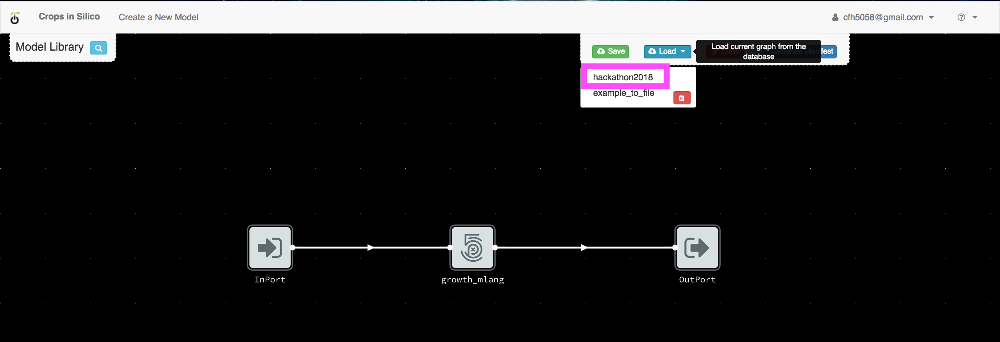
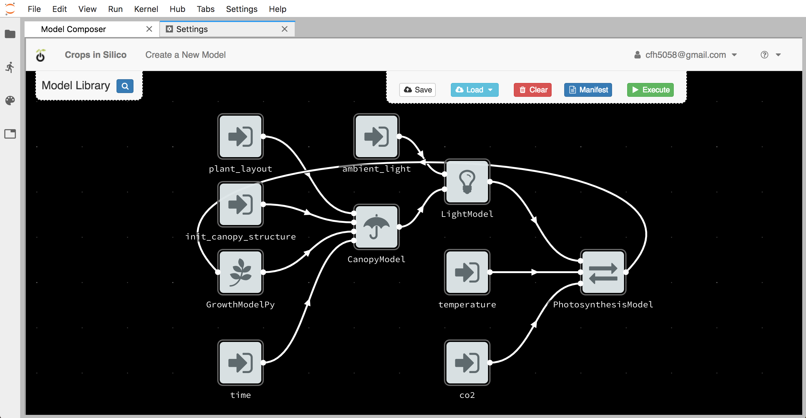
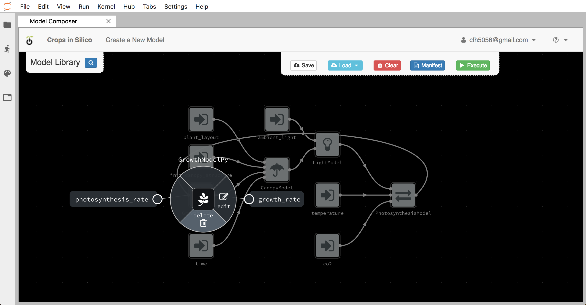
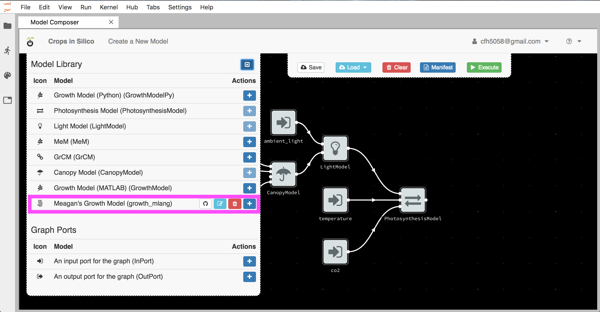
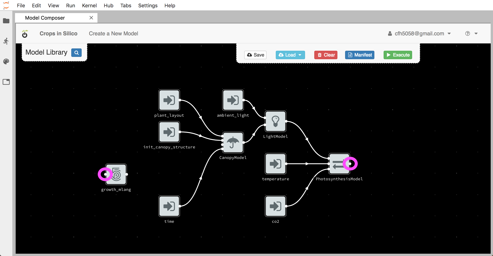
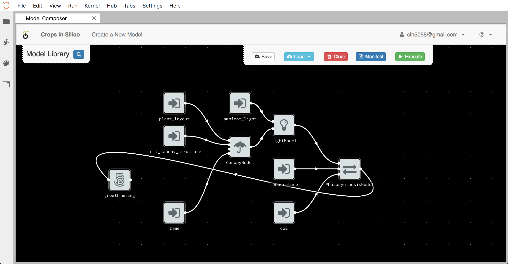
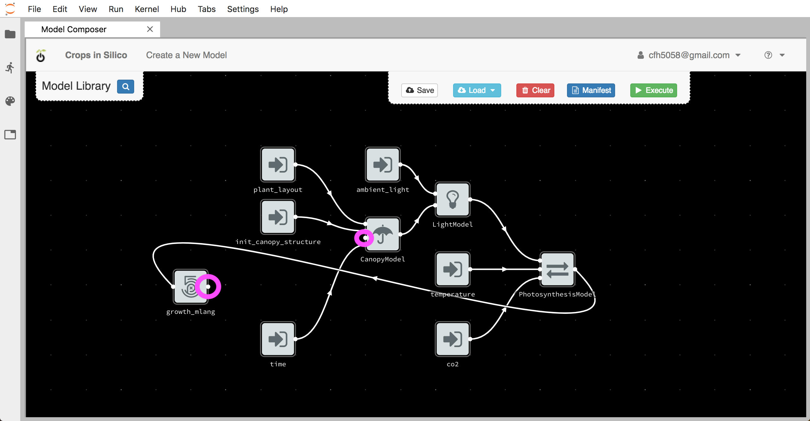
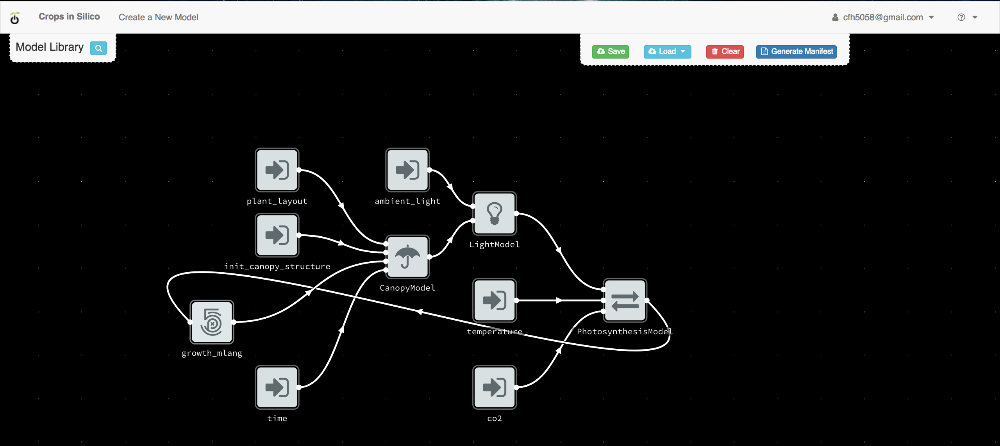
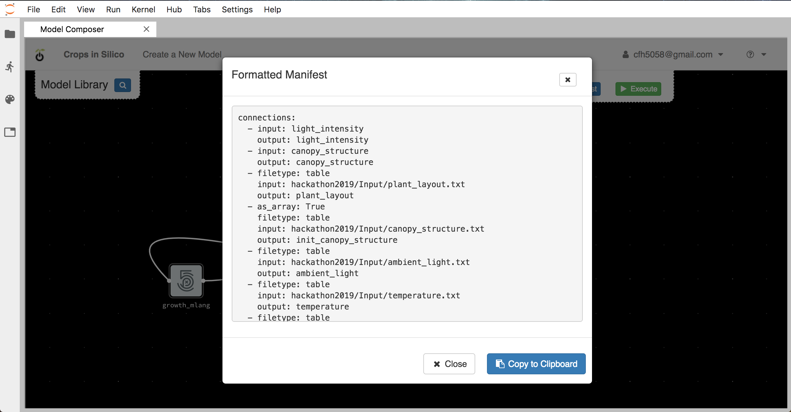

Connecting Models to Models
###########################

Next we will connect your growth model to the existing network of models by 
replacing the existing growth model. From 
the user interface, load the ``hackathon2019`` integration network. 

You will see the network of 4 models connected to 6 input files from before.

Deleting the Old Model
----------------------

By right-clicking on the existing growth model, you can delete the existing 
model from the canvas.

Adding Your Model
-----------------

You can then add your model by clicking the blue ``+`` button next to your 
model in the model palette.

Once the model is added to the canvas, move it to the left of the canvas.

.. image:: interface_images/network_no_connect.png

Making Connections
------------------

Now we want to connect our growth model to the other models in the network. 
First we connect the input dot (on the left side) for our growth model to 
the output from the photosynthesis model.

To make the connection, click on one dot and then the other.

Next we connect the output from our growth model to the growth rate input 
channel of the canopy model, by again clicking on one dot and then the other.

Creating the YAML
=================

Once you have finalized your model connections, you can use the interface to 
create your YAML file by clicking the ``Generate Manifest`` button,

Copy this information to you clipboard and past it into a new file 
called ``growth_network.yml`` in the ``ygg_home`` directory.

Running the Model-to-Model Integration
======================================

You can run the integration you just created by executing::

  $ yggrun growth_network.yml

from the ``ygg_home`` directory. This will output information on the 
screen from all of the models being run.
