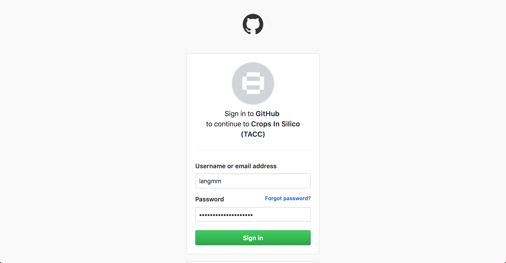
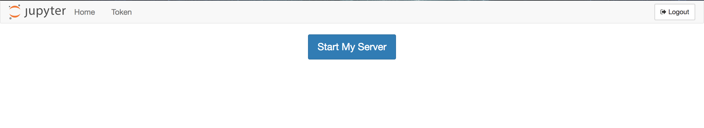
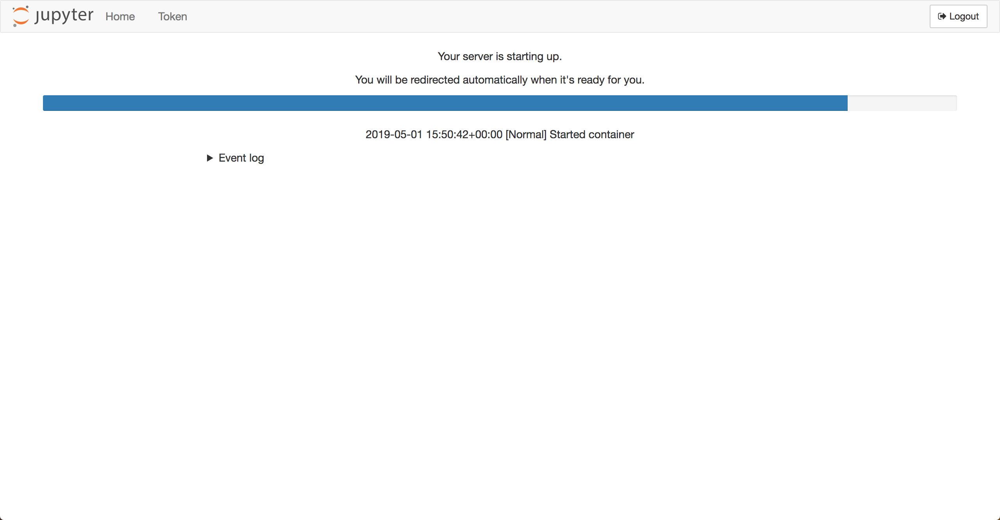
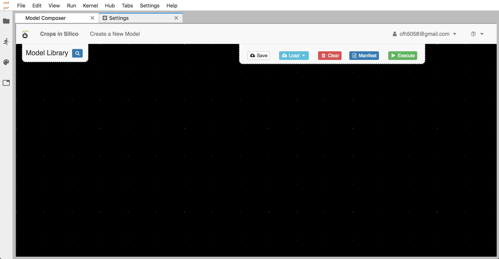
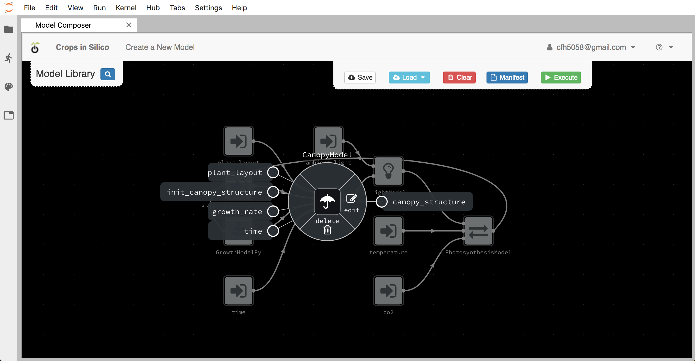
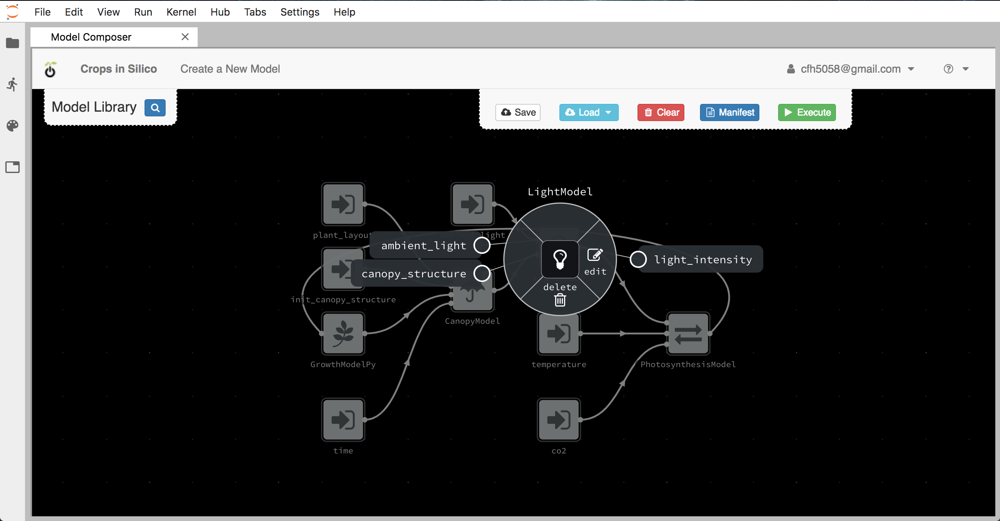
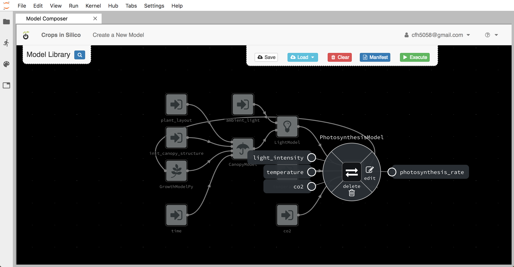
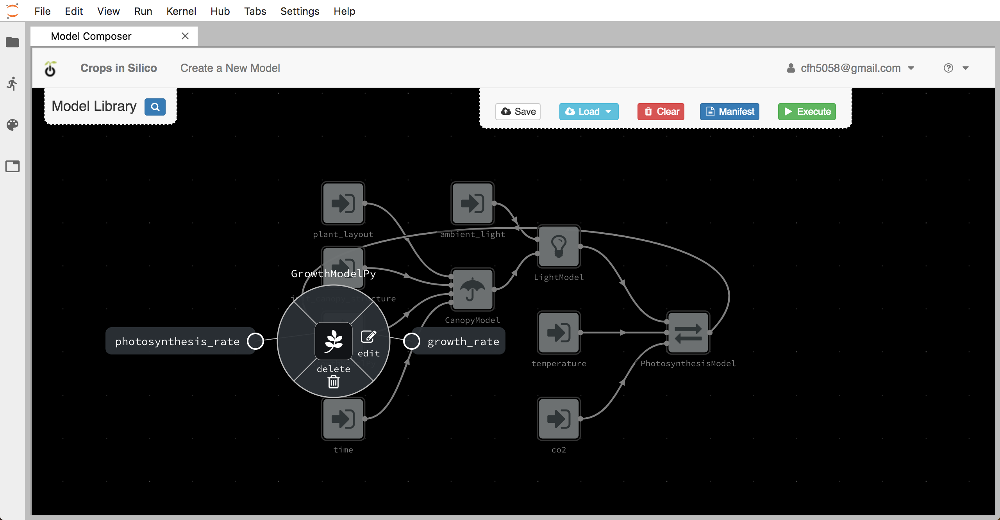
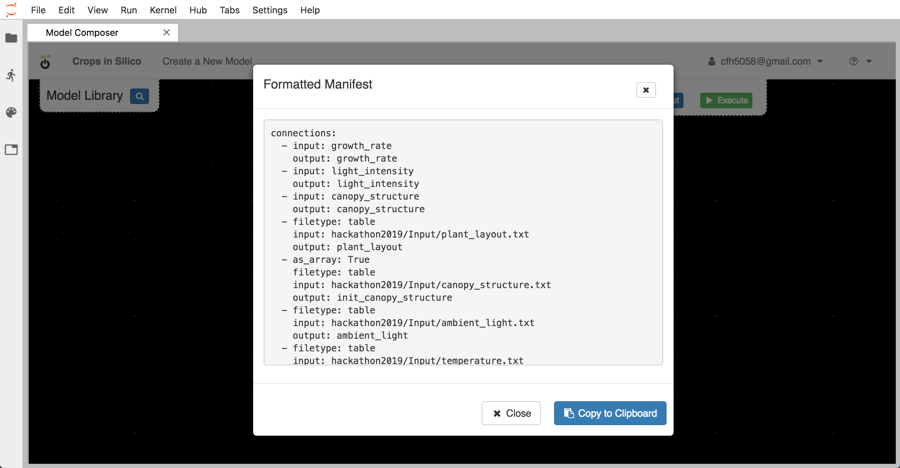

Introduction to the User Interface
##################################

Starting the Jupyter Hub
========================

During the hackathon we will be using the user interface (UI) located
`here <https://cropsinsilico.ndslabs.org>`_.

.. image:: interface_images/interface_landing.png

You will need to log in with your Github username and password

	  
and then start a server.

This may take a moment.
   

	   

Orientation
===========

Once the server is started, you will see a Jupyter hub interface that includes
a ``Model Composer`` tab. Within the ``Model Composer`` tab you have a canvas (the black
area), a model palette titled ``Model Library`` in the upper left corner of the canvas
that is populated with examples models from a dedicated model repository, and several
actions buttons in the upper right corner of the canvas. The ``Save`` button will save
graphs to your workspace, the ``Load`` button provides a drop-down menu of several
pre-defined graphs containing the models listed in the model palette that can be loaded
into the canvas, the ``Clear`` button will clear any models/connections from the canvas,
the ``Manifest`` button will display the YAML file required to run the currently loaded
graph locally, and the ``Execute`` button will run the currently loaded graph (assuming
the models are loaded into the workspace).

Loading & Running an Existing Integration
=========================================

First we will load and execute an existing integration graph that is pre-loaded into
the Jupyter hub. From the ``Load`` drop down menu, select the ``Fakeplant`` option to
load an example integration network that uses the models from the ``hackathon2019``
repository that we cloned in preparation.

.. image:: interface_images/interface_load.png

Once loaded you will see several icons connected with white lines that represents
4 models connected to 6 input files.

.. image:: interface_images/network_original.png

Each icon represents one of the models in the ``hackathon2019``
repository that you cloned to your local machine or an input/output file.
By right clicking on each model, you can get information about the model's 
inputs and outputs.

The canopy model takes as input an initial canopy structure, a growth rate, 
a plant layout describing how the plant grows in x, y, and z, and a time step. 
From this information it grows the canopy structure and outputs the updated 
structure. The canopy model is written in C++.

The light model takes as input an ambient light level and the 3D structure of 
the canopy. It then calculates the light incident on each facet of the canopy 
structure which it outputs.

The photosynthesis model takes as input a light intensity, temperature, and 
CO2. From this information, it calculates and output the photosynthesis rate. 

The growth model in this network is an alternative to the growth model we 
were working with in the previous section. It takes photosynthesis rate as 
an input and outputs the growth rate. We will be replacing this growth model 
with the one you created.

You can trace the data as it flows from files and from one model to the next.

You can view the
YAML generated from the integration graph by clicking the ``Manifest`` button.

You can run the integration by clicking the ``Execute`` button. Once the models begin
running, a window display the output log will pop up.

.. image:: interface_images/network_original_log.png

The output log will include log messages from |yggdrasil| about the model execution 
intermingled with output from the models themselves. Because the model run in parallel
and communication output at different rates, the model output may or may not be
sequential.

In the next we will integrate a new growth model and add it to this integration
network as a replacement for the existing growth model. 
