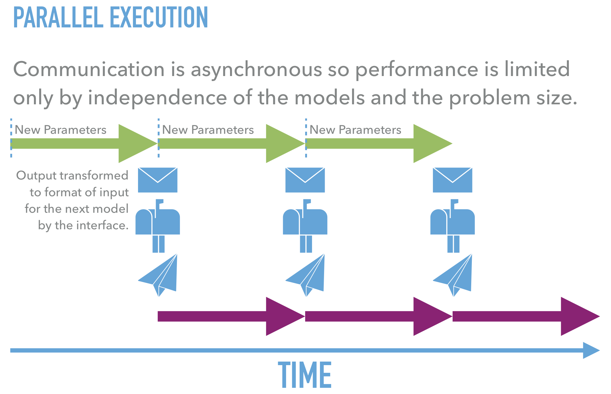
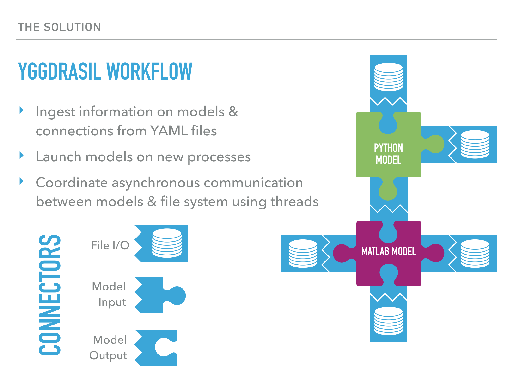

Introduction to Yggdrasil
#########################

Parallel Processing
===================

Communication
=============

Model API
=========

The API classes/functions in each language provide the models 
with methods of sending and receiving messages to and from files and other 
models.

Python API
----------

::

  from yggdrasil.interface.YggInterface import YggInput, YggOutput

  input = YggInput('input_name')
  output = YggOutput('output_name', '%f\t%f\n')

  flag, data = input.recv()
  flag = output.send(1.0, 2.0)

Matlab API
----------

::

  input = YggInterface('YggInput', 'input_name');
  output = YggInterface('YggOutput', 'output_name', '%f\t%f\n');

  [flag, data] = input.recv();
  flag = output.send(1.0, 2.0);

C API
-----

::

  #include "YggInterface.h"

  yggInput_t input = yggInput("input_name");
  yggOutput_t output = yggOutput("output_name", "%f\t%f\n");

  float a;
  float b = 1;
  float c = 2;
  int flag = yggRecv(input, &a);
  flag = yggSend(output, b, c);

C++ API
-------

::

  #include "YggInterface.hpp"

  YggInput input("input_name");
  YggOutput output("output_name", "%f\t%f\n");

  float a;
  float b = 1;
  float c = 2;
  int flag = input.recv(&a);
  flag = output.send(b, c);

R API
-----

::
   
   library(yggdrasil)

   input <- YggInterface('YggInput', 'input_name')
   output <- YggInterface('YggOutput', 'output_name', '%f\t%f\n')

   c(flag, data) %<-% input$recv()
   flag <- output$send(1.0, 2.0)

.. note::
   The R API is only available on the development branch 'topic/R' at the
   moment, but will be part of the release in the coming month.
