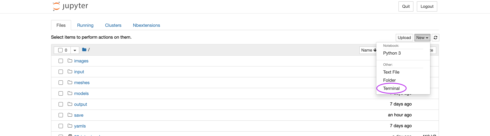
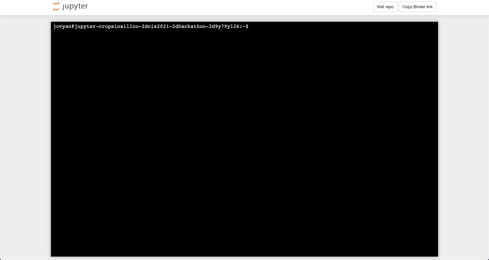
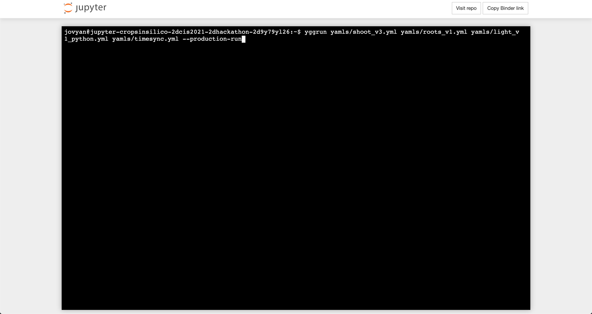
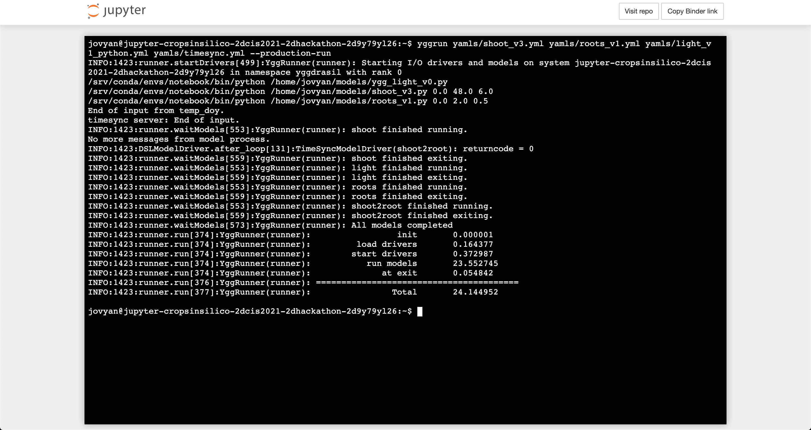
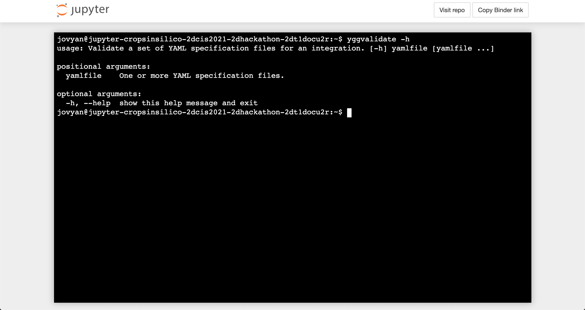
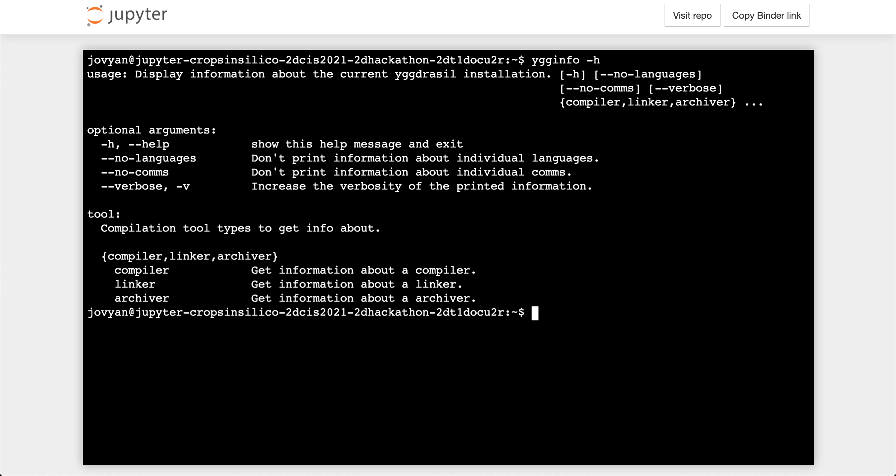
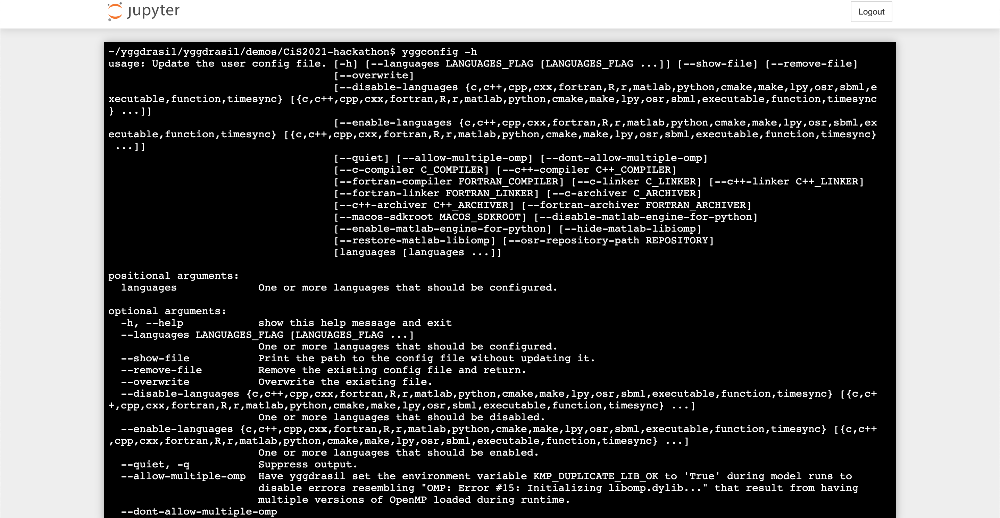
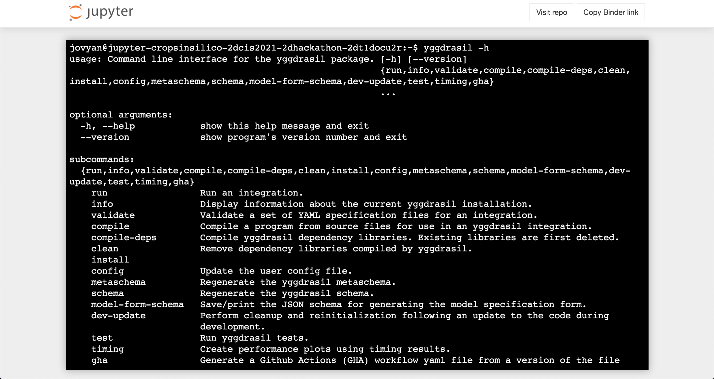

Command Line Interfaces (CLIs)
##############################

|yggdrasil| offers several command line interfaces (CLIs) that can be useful when developing or running an integration.

Running Integrations
====================

Although the notebooks run integration via the ``from yggdrasil.runner.run`` Python method, the typical method for running integrations is via the command line using the ``yggrun`` (or ``yggdrasil run``) CLI. You can try out the CLI by opening a terminal from the notebook server (as shown below).

Once the terminal is open, you can execute commands just as you would on a local command line.

To display the options for the CLI, you can run ``yggrun -h`` and should see similar output to that shown below.

The same integrations that were run in the notebook can also be run via the command line. For example, you can see the output from running the time step synchronizaiton example with multiple light models via::

   yggrun yamls/shoot_v3.yml yamls/roots_v1.yml yamls/light_v1_python.yml yamls/timesync.yml --production-run

The ``--production-run`` flag has the same effect as passing ``production_run=True`` to the ``run`` method in the notebook (disables some validation steps in order to improve performance).

Validating Integration YAML(s)
==============================

The ``yggvalidate`` (or ``yggdrasil validate``) CLI allows users to check if a set of YAML files defining an integration is valid. This includes checking the YAML syntax, options and structure (via conformation to the schema), and connections (that there are not any unconnected inputs/outputs).

Checking the Installation
=========================

The ``ygginfo`` (or ``yggdrasil info``) CLI prints out various information about the |yggdrasil| installation including versions of dependencies, locations of tools, language status (e.g. missing dependencies, options), etc.

Configuring the Installation
============================

The ``yggconfig`` (or ``yggdrasil config``) CLI allows the user to adjust the |yggdrasil| installation including compiler/linker/interpreter versions, distabling/enabling languages, setting run time defaults, etc.

General CLI
===========

|yggdrasil| offers several other CLIs that are outside the scope of this introduction, but can be accessed via the ``yggdrasil`` CLI as subcommands. This is why the CLIs discussed above all have a second method of being run (e.g. ``ygginfo`` vs ``yggdrasil info``).

