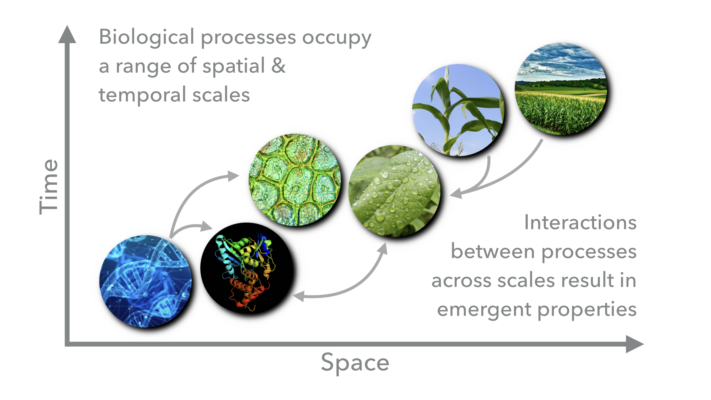
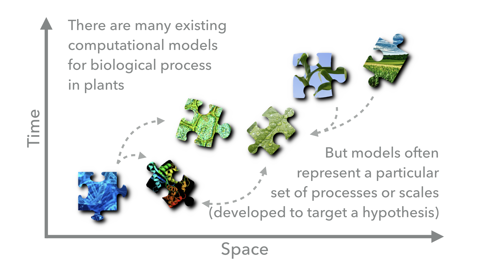
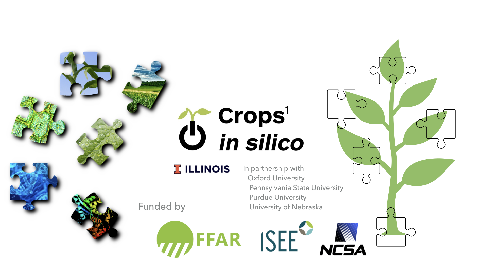
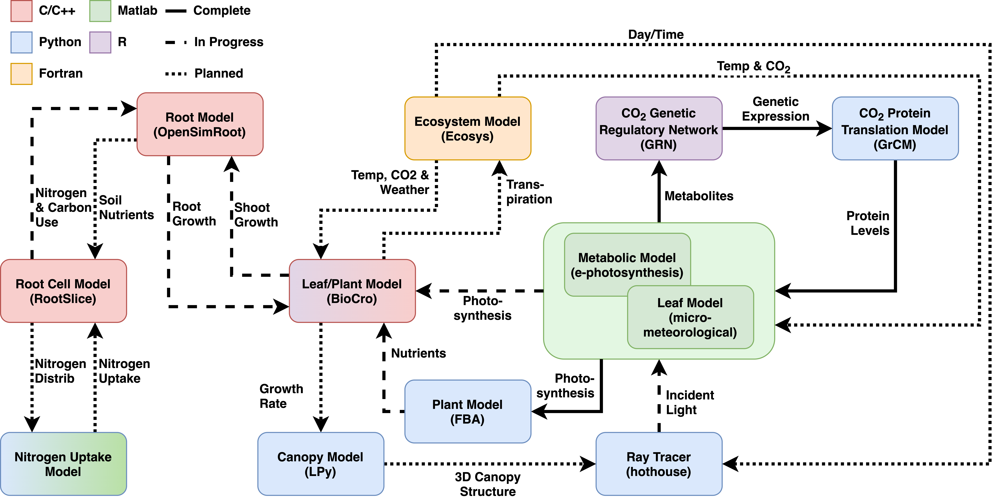

.. _intro_rst:
Introduction to Yggdrasil
#########################

What
----

Yggdrasil is a Python package developed to allow scientists to connect computational models across programming languages and scales in time and space. Although designed for connecting models of crop biology, yggdrasil can be applied to models in any field.

Why
---

Biological processes span wide ranges of temporal and spatial scales and are highly interconnected through complex and dynamic relationships. Feedback between processes at different scales can result in emergent properties.

	   
There are a wide variety of computational biological models that are designed to target specific scientific questions and operate at different scales or in different biological components. By connecting these models we can capture the emergent properties resulting from the interactions between the biological processes that the models represent. However, because the models were originally developed with specific questions in mind by different groups of researchers, they will often be incompatible due to differences in programming language, units, simulation framework, or data type. Yggdrasil aims to lower these barriers and allow scientists to reuse existing models to answer new questions.

How
---

Communicators
*************

Yggdrasil provides interfaces in each of the supported languages (see below) that allow models to send and receive data to/from other models. `Comms` are the communicators that these interfaces open. Yggdrasil supports multiple methods for passing these messages and handle's the selection behind-the-scenes based on the operating system and installed dependencies. Supported communication types include ZeroMQ sockets, SYS V Interprocess Communication (IPC), RabbitMQ brokered connections, files, and buffers (Python based interfaces).

Regardless of the underlying communication mechanism, communication between models is asynchronous so that when sending a message, a model can keep performing computations without waiting for the other model (or file) to receive teh message.

Units & data types
******************

Yggdrasil also allows convertion between units and data types between models. By declaring the type of data expected/produced by a model, users can let yggdrasil determine how data should be passed to/from other models. Unit conversion are handled by `unyt <https://unyt.readthedocs.io/en/stable/>`_ in Python, `symbolic units <https://www.mathworks.com/help/symbolic/units-of-measurement-tutorial.html>`_ in MATLAB, and `units <https://cran.r-project.org/web/packages/units/index.html>`_ in R. Supported data types include the native primitive (e.g. integers) and composite (e.g. arrays) data types in each of the supported languages as well as tables/data frames, ply & obj wavefront 3D meshes, language-specific data formats (e.g. Python pickle, MATLAB .mat, & R .Rdata), and generic type wrappers (for compiled languages).

Control
*******

Users tell yggdrasil about the models and connections that should be run as part of an integration network via `YAML <https://yaml.org/>`_ configuration files. Model entries describe where the model is located, what languages it is written in, how it should be run, and what inputs/outputs the model has. Connection entries match model inputs/outputs with other model inputs/outputs and/or files.

Execution
*********

Integrations are run by passing the YAMLs defining the network to, ``yggrun`` (alternatively ``yggdrasil run``), the yggdrasil command line interface (CLI). Although not currently hosted, there is also a graphical user interface (GUI) under development for composing YAML configuration files and running integration.

Who
---

Yggdrasil has been developed for the `Crops in Silico Project <https://cropsinsilico.org/>`_ which aims to develop tools to combine information on genomes, phenomes, and ecosystems in order to capture the emergent properties of the complex, nonlinear systems governing crop growth and production. Insights from these models can then be used to accelerate food production in a changing climate through breeding, bioengineering, and field level interventions.

The connections between models that are complete, in progress, and planned by the Crops in Silico Project using yggdrasil are shown below.

