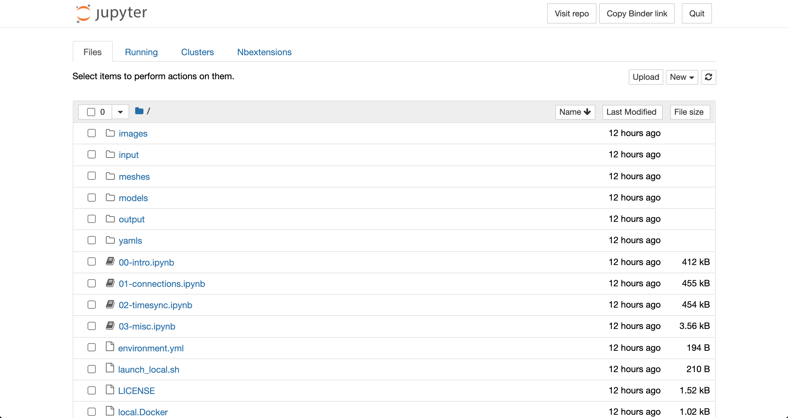

Introduction to Jupyter Notebooks
#################################

After following one of the three sets of instructions for :ref:`setting up the hackathon materials <setup>`, you should see a file browser similar to the one shown below in your web browser.

This page is showing you the contents of the `hackathon materials repository <https://github.com/cropsinsilico/CiS2021-hackathon>`_ that are being accessed by a Jupyter server. You can open the first notebook by clicking on the ``00-intro.ipynb`` file which will launch the notebook in a new tab.

Jupyter notebooks like this one are useful for running code alongside text and graphics giving context to the code and plots & animations of results from the code. For descriptions of the examples and tasks presented in the notebooks, including how to run code, refer to the text within the notebooks. Brief descriptions of the included notebooks can be found below.

====================  =======================================================
Notebook              Description
====================  =======================================================
00-intro.ipynb        Introduction to Jupyter notebooks, integrating models
                      via automated wrapping of functions, connecting models
		      to files, & integrating models via explicit interface
		      calls.
01-connections.ipynb  Connecting models to other models, server-client
                      communication patterns, & running multiple copies of
		      models.
02-timesync.ipynb     Synchronizing data between models that simulate 
                      processes over time & how yggdrasil deals with
		      differences in the time steps.
03-misc.ipynb         Calling models as functions from Python.
====================  =======================================================

Some notes about notebooks
==========================

* Output from cells that is very long will be collapsed to a scrollable box in order to save space. Such outputs can can be expanded by clicking the rectangle on the left side of the output.
* The notebook server will allow you to execute cells out of order, but the notebooks provided for this hackathon assume that the cells are executed in the order they appear in the notebook. If you execute cells out of order, it is possible that they will fail if they depend on packages or variables defined in cells further up in the notebook.
* Interrupting the kernel while there is a yggdrasil integration running will only print out the status of the integration. To actually stop it, the interrupt must be performed twice in a short span of time (<5 s). The same is true for interuppting a run on the command line via ``Ctrl+C``. This allows users to check the status without constant status messages.
