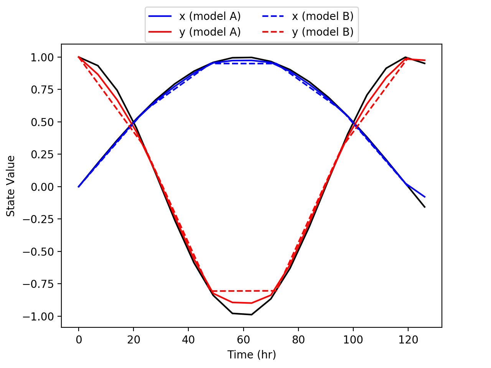
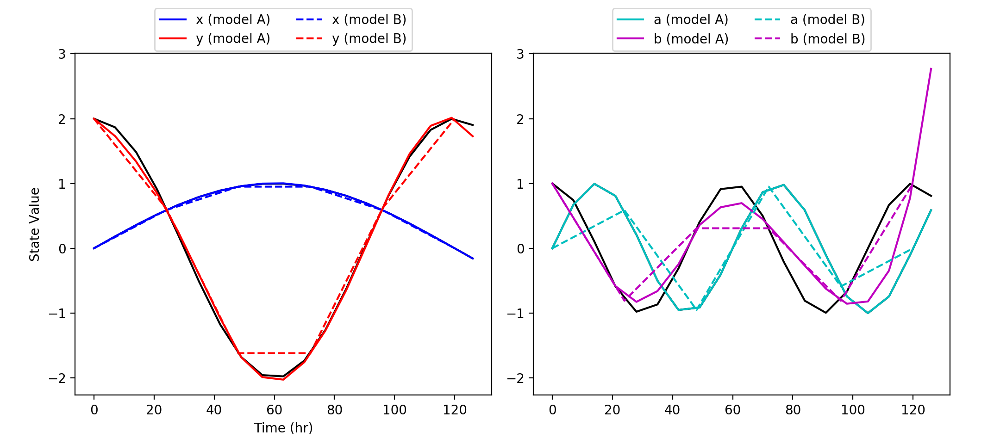

.. _timesync_io_rst:

Timestep Synchronization
========================

Many models are time dependent with variables being updated as the time is incremented. When integrating two (or more) models that have timestep's, care must be taken to ensure that variables are correctly synchonized between the models at each timestep. To aid in this process |yggdrasil| provides a special timestep synchronization interface and model driver. Synchronizations proceeds as follows:

#. A client model **requests** synchronization at a given timestep by calling the synchronization interface with the time of the desired timestep (with units) and any local state variables to the synchronization driver.
#. The synchronization driver **converts** synonymous state variables from all models to a base set of state variables.
#. The synchronization driver **interpolates** state variables from all models to get values at the time received from the client.
#. The synchronization driver **aggregates** state variables across models for the requested time (including interpolated values).
#. The synchronization driver **converts** the aggregated base set of state variables to the synonymous state variables used by the client model.
#. The synchronization driver **responds** to the client model that issued the request with the resulting state variables.

Example Using Defaults
----------------------

In the example below, two model are initialized from the same source code. Both models have two state variables (``x`` and ``y``) that are calculated as a sine and cosine with periods of 10 days and 5 days respectively; the two models differ only in the size of their timesteps and the units that they use to represent time (the timestep and units for each model are set by input arguments to the model as passed in the yaml).

In the yaml file below, the models are defined as usual, but they also have the ``timesync`` parameter set to ``True``. Setting the ``timesync`` parameter tells |yggdrasil| that the model has time dependent variables that need to be synchonized. The ``timesync`` parameter can also be set to a string that will be used to group models that should be synchronized; in this way, sets of models can be independently synchronized (e.g. if there are unrelated processes that don't need to be synced). For each unique value of the ``timesync`` parameter in the provided yamls, |yggdrasil| sets up a specialized model with that name to handle synchronization between the models with the same ``timesync`` parameter value (setting ``timesync`` to ``True`` creates a specialized timestep synchronization model with the name ``timesync``).

.. include:: examples/timesync1_yml.rst

In addition to the yaml parameter, models performing timestep synchronization will need to make use of the timestep synchronization interface. In Python, this is ``YggTimesync``. At each timestep (including the initial time), the model executes the ``call`` method for the timestep synchronization interface. The output variable (the variable being sent as a request by the ``call`` method) is excepted to be the time of the timestep and a mapping type between state varaible names and their values at the timestep. The return variable (the variable received in response by the ``call`` method) will be a mapping type between state variable names and their values that have been updated with information from the other models.
	     
.. include:: examples/timesync1_src.rst

Below is the result of the synchronization between the two models. The states variable ``x`` and ``y`` are shown in blue and red respectively, solid lines show results for model A, dashed lines show results for model B, and the True values for ``x`` and ``y`` are plotted in black.

Model B has a larger timestep than model A so values for model B are interpolated to get values at the timesteps for model A. The default interpolation method assumes a linear relationship between values and the default aggregation method averages across all models; as a result, the values for the model with the smaller timestep (model A) end up being pulled away from the "True" value when aggregated with the interpolated with the values from the model with the larger timestep (model B). There are ways to control how timesteps are synchronized (as discussed below), but in practice, integrating two models of the same process with the same degree of accuracy that use different timesteps is unlikely to be useful.

Controlling Synchonization
--------------------------

There are several ways to customize how timesteps are merged between models. In order to set these options, an explicit entry must be added to the yaml for the timestep synchronization model. At a minimum the timestep synchronization model yaml entry should have ``language: timesync`` and it's name should be the same as the ``timesync`` parameter value for the models it will synchronize (``'timesync'`` if the models have ``timesync: True``). Additional parameters in the timestep synchronization model yaml entry will be used to control how timesteps are synchronized.

In the example below, these parameters are used to modify how the state variables are synchronized. Models A and B are identical except:

* Model A has state variables ``x`` and ``y`` while Model B has state variables ``xvar`` and ``yvar`` (set in the yaml)
* ``xvar`` in Model B is equal to half of ``x`` in Model A

.. include:: examples/timesync2_yml.rst

(The source code associated with this model is very similar to the souce code above, but can be found `here <examples/timesync2.html>`__ for reference.)

Synonyms (Conversion)
~~~~~~~~~~~~~~~~~~~~~

It is unlikely that variables will match perfectly between models, beit in name or definition. For example, in the model defined above, model A and B use different names to describe the same variable (``y`` and ``yvar`` respectively). Similarly the variables ``x`` and ``xvar`` used by models A and B respectively are analagous, but ``xvar`` is defined slightly differently (namely ``xvar=x/2``).

To handle reconcilation between analagous variables, |yggdrasil| allows users to define relationships between variables in different models using the ``synonyms`` parameter. The value for the ``synonyms`` parameter should be a mapping between model names and mapping from base variable names (these should be variables named by one or more models) and the analogous variable that the model uses. If the model just uses a different name for the same concept as the base, this can be just a string (e.g. the ``synonyms`` entry for ``y`` in ``modelB`` above). If additional calculations are required to convert between the variables used in the models, a mapping can be provided (e.g. the ``synonyms`` entry for ``x`` in ``modelB``). The keys in the entry should be:

* ``alt``: One or more state variables used by the model to calculate the base state variable.
* ``alt2base``: Function for converting from the state variable(s) used by the model to the base variable.
* ``base2alt``: Function for converting from the base variable to the state variable(s) used by the model.

.. note::
   
   Units conversions will be handled by |yggdrasil| and do not need to be addressed by the ``synonyms`` parameters so long as the state variables have units when passed to the timestep synchronization interface ``call`` method.

Interpolation
~~~~~~~~~~~~~

Aggregation
~~~~~~~~~~~

In addition to dictionaries mapping from variable to method, a single value can be provided for the ``aggregation`` and ``interpolation`` parameter; the same method will the be used for all of the variables e.g.::
  
  - name: statesync
    language: timesync
    synonyms:
      modelB:
        x:
	  alt: xvar
	  alt2base: timesync:xvar2x
	  base2alt: timesync:x2xvar
        y: yvar
    interpolation: nearest
    aggregation: min

.. note::
   
   Since each synchronization call invokes overhead, it is not advised that the ``call`` method be executed inside integration methods. Instead, synchonization ``call`` methods should be executed at larger timesteps.
